# BruinSplit

<div align="center">
  
</div>

Uber, Lyft, and Waymo rides are increasing in price, and students tend to grab a ride to the same destination at the same time while paying full price. If two students both go to LAX at 8pm after their finals, why not split the cost? 

Built to address this, Bruinsplit is a web app that helps UCLA students find other students to split the cost of a ride somewhere. It will let users create an account, create/post or join rides based on time, origin, and destination; users can also communicate with members of a ride and add other users as friends.

# Tech Stack:

<div align="center">
  <a href="https://react.dev/" target="_blank" style="margin: 0 32px; display: inline-block;">
    
  </a>
  <a href="https://nodejs.org/" target="_blank" style="margin: 0 32px; display: inline-block;">
    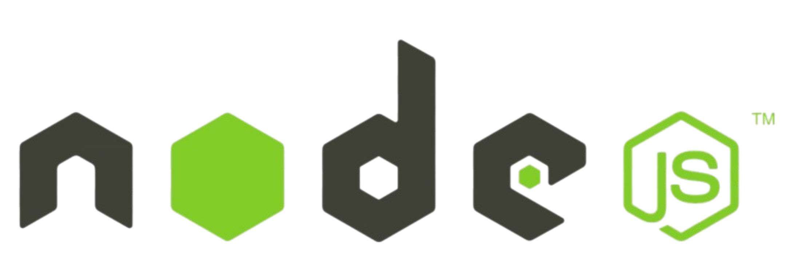
  </a>
  <a href="https://supabase.com/" target="_blank" style="margin: 0 32px; display: inline-block;">
    
  </a>
</div>

# Installation Instructions:

1. **Clone the repository:**
   ```bash
   git clone https://github.com/joshuajin06/BruinSplit.git
   cd BruinSplit
   ```

2. **Install Node.js:**
   - Download and install [Node.js](https://nodejs.org/en/download)
   - Verify installation:
     ```bash
     node -v
     ```

3. **Install backend dependencies:**
   ```bash
   cd backend
   npm install
   npm install @supabase/supabase-js dotenv
   ```

4. **Install frontend dependencies:**
   ```bash
   cd ../frontend/bruinsplit
   npm install
   npm install react-router-dom
   ```

5. **Set up environment variables:**
   - Create a `.env` file in the `backend` directory with your Supabase credentials

# Running the Server:

Run the following commands in separate terminals:

**Terminal 1 - Backend Server:**
```bash
cd backend
node server.js
```

**Terminal 2 - Frontend Server:**
```bash
cd frontend/bruinsplit
npm run dev
```

# Diagrams:

These two diagrams display the system architecture and database schema for BruinSplit.

<div align="center">
  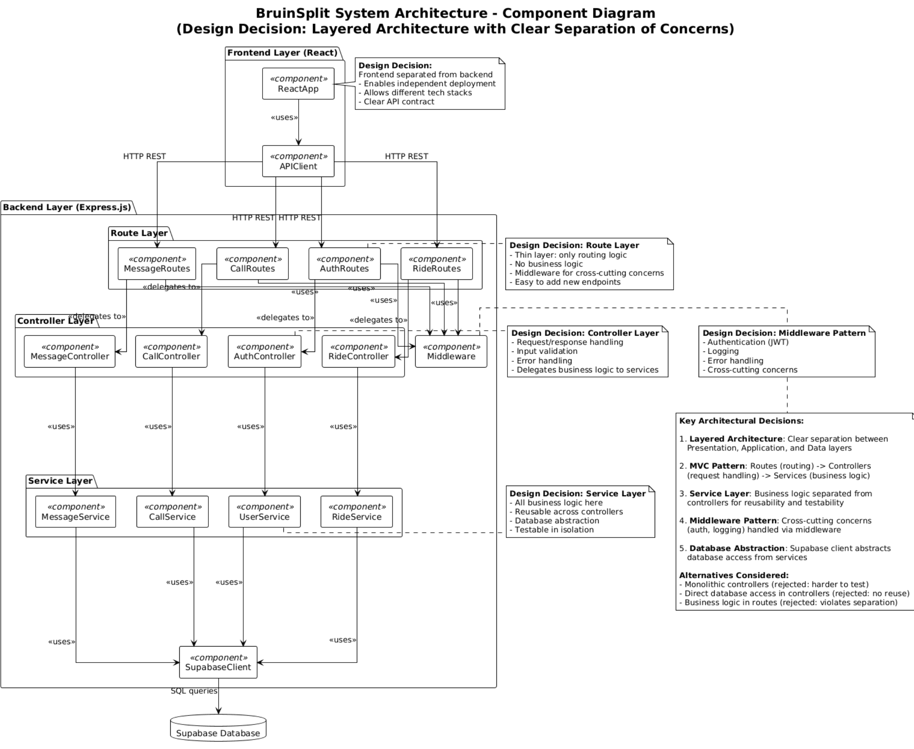
  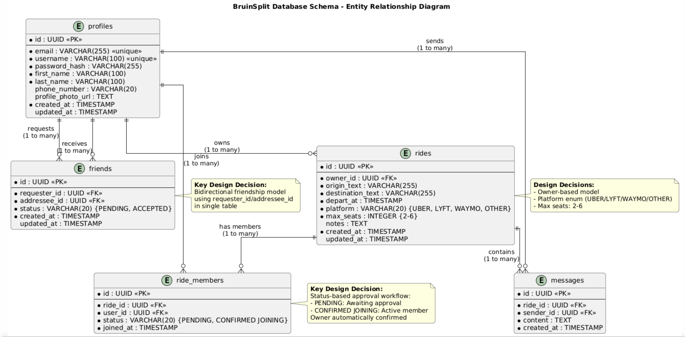
</div>

# API Documentation:

After running the backend server (see [Running the Server](#running-the-server) section above), you can access the interactive API documentation.

**Access the documentation:**
- **Interactive API Documentation:** [http://localhost:8080/api/docs](http://localhost:8080/api/docs)
- **Raw JSON Specification:** [http://localhost:8080/api/docs-json](http://localhost:8080/api/docs-json)

The interactive documentation allows you to explore endpoints, view schemas, and test API calls directly from your browser.

## Interactive Documentation Interface

The Swagger UI interface for exploring all available endpoints and testing API calls.
<div align="center">
  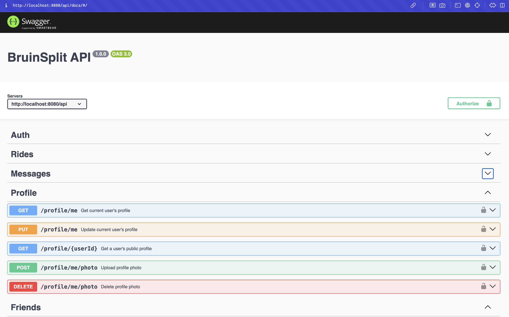
</div>

## Endpoint Details and Testing

View detailed endpoint documentation including request parameters, response schemas, and authentication requirements.
<div align="center">
  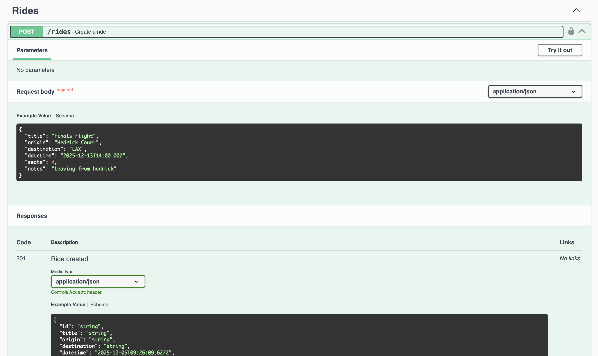
</div>

# Main Features:

## Account Creation & Authentication
Create a new account to get started with BruinSplit and join the ride-sharing community.
<div align="center">
  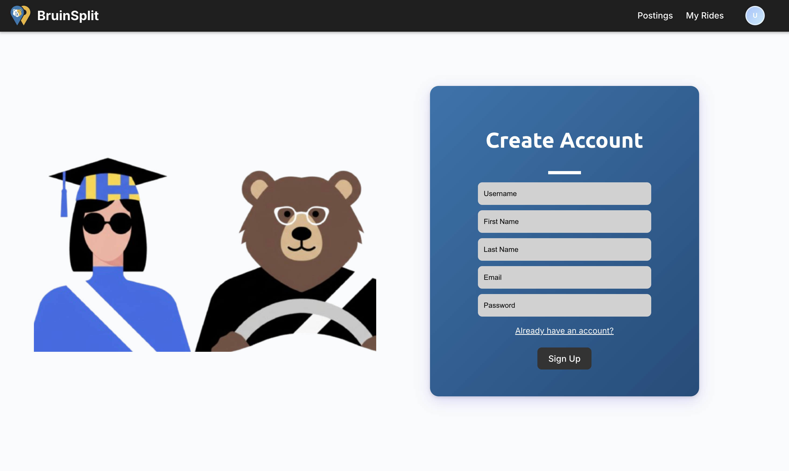
</div>

## Login
Secure login to access your BruinSplit account and manage your rides.
<div align="center">
  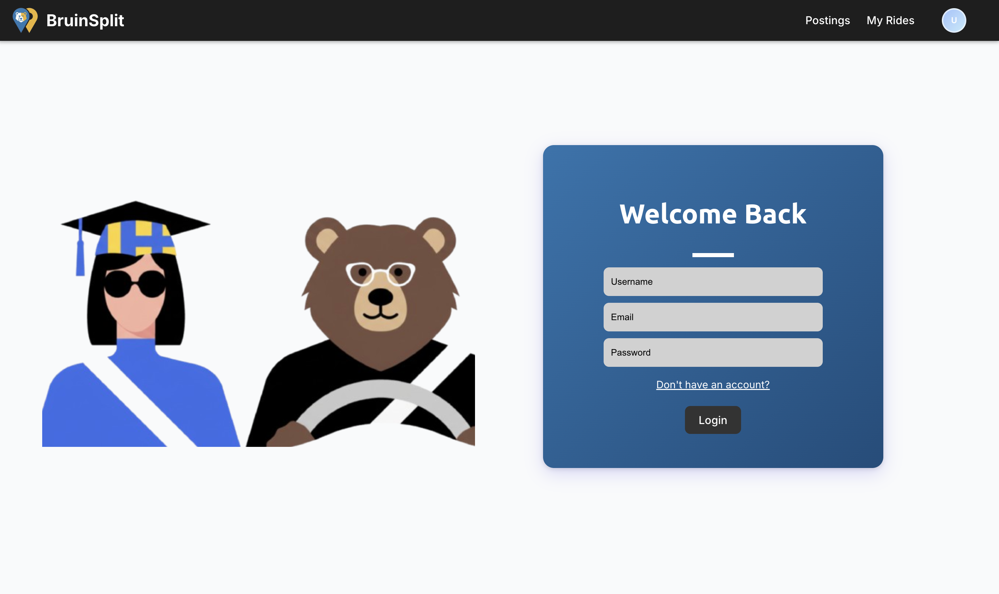
</div>

## Homepage
Browse available rides and discover opportunities to split costs with other UCLA students.
<div align="center">
  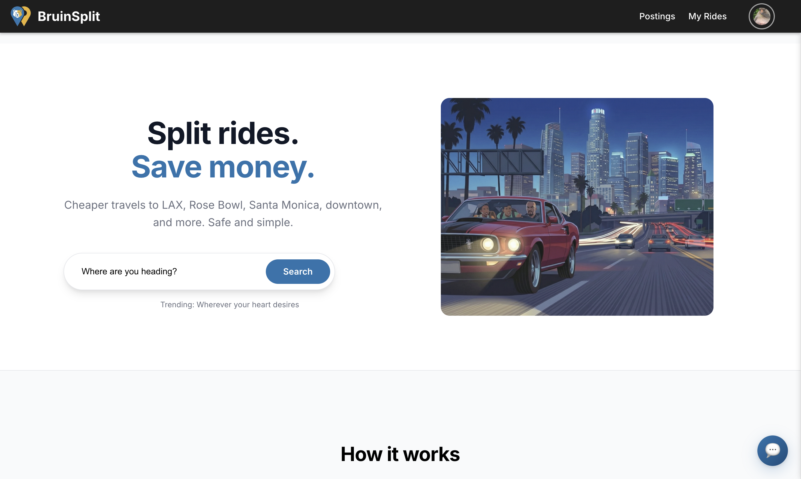
</div>

## Browse Ride Postings
View all available ride postings with details about origin, destination, time, and available seats.
<div align="center">
  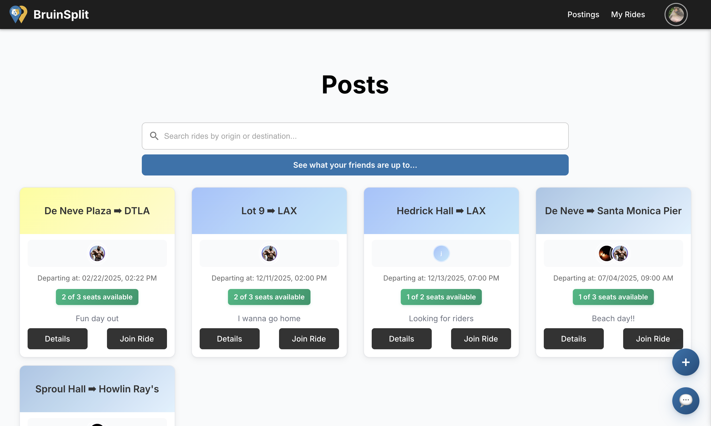
</div>

## My Rides
Manage your created rides and see all the rides you've joined in one convenient location.
<div align="center">
  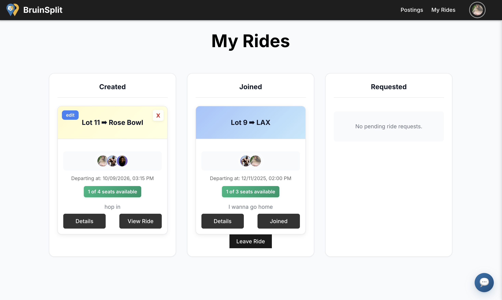
</div>

## Ride Logistics
View detailed information about a ride including all logistics, route details, and participant information.
<div align="center">
  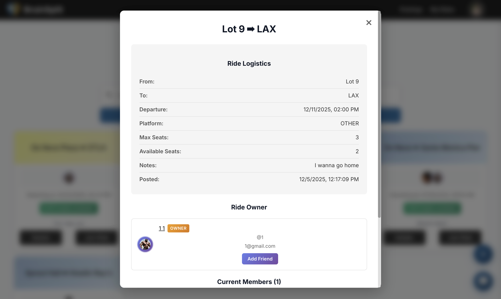
</div>

## Current Riders
See who's joining your ride and manage the list of participants for each ride.
<div align="center">
  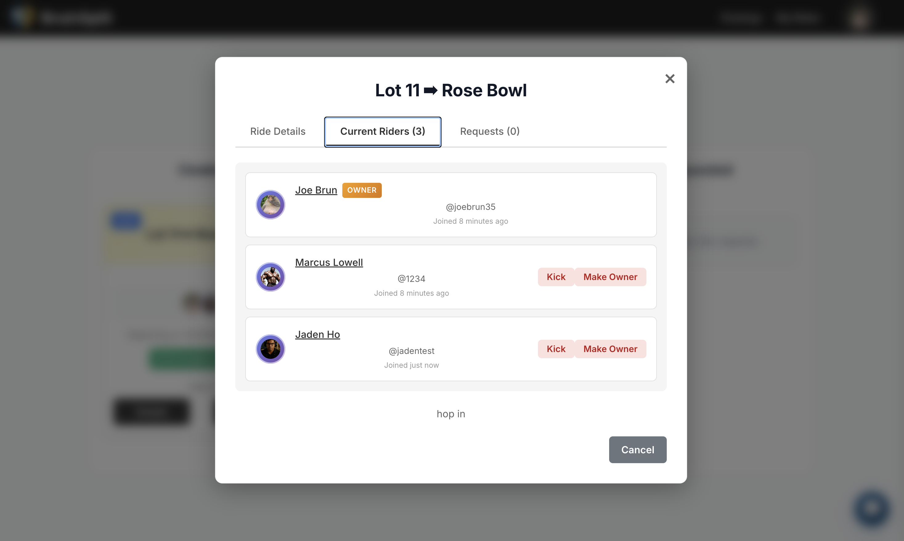
</div>

## User Profile
View and edit your profile information, including your bio, contact details, and profile picture.
<div align="center">
  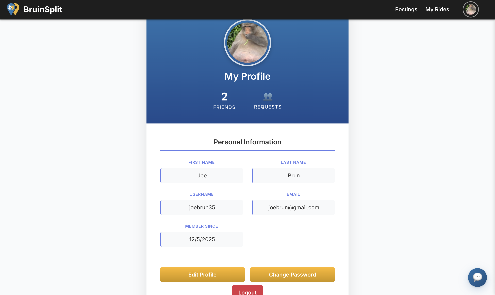
</div>

## Friends List
Browse and manage your list of friends on BruinSplit to easily coordinate rides together.
<div align="center">
  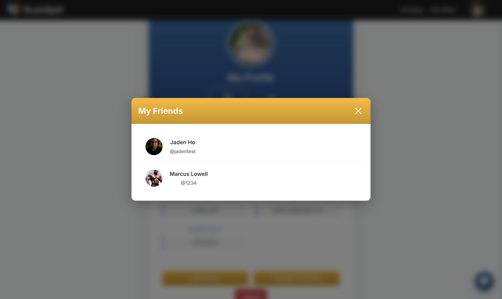
</div>

## Friend Profile
View your friends' profiles to see their information and coordinate rides with them.
<div align="center">
  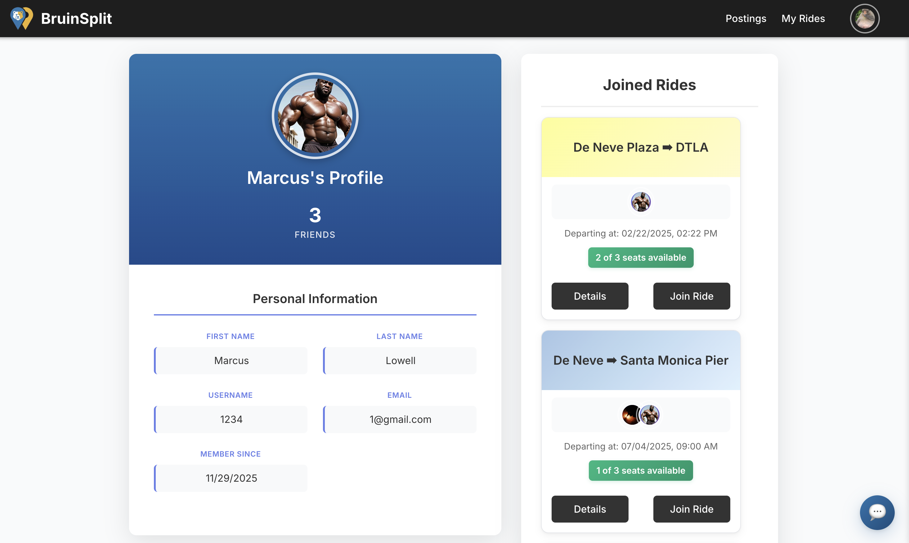
</div>

## Messaging
Communicate with other riders through in-app messaging to coordinate ride details and logistics.
<div align="center">
  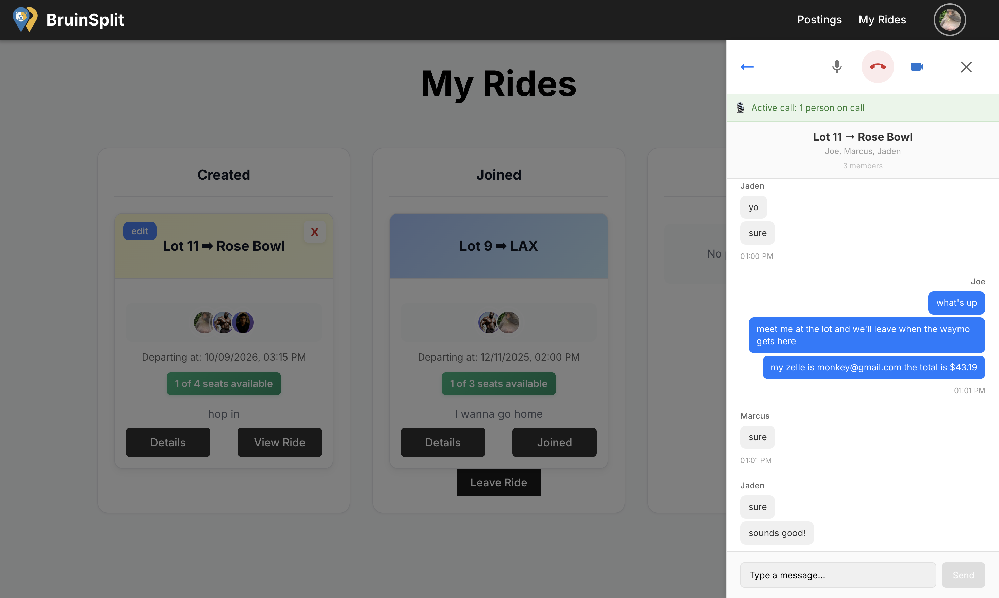
</div>

# Creators 
Jaden Ho, Anish Kumar, Joshua Jin, Justin Luc
